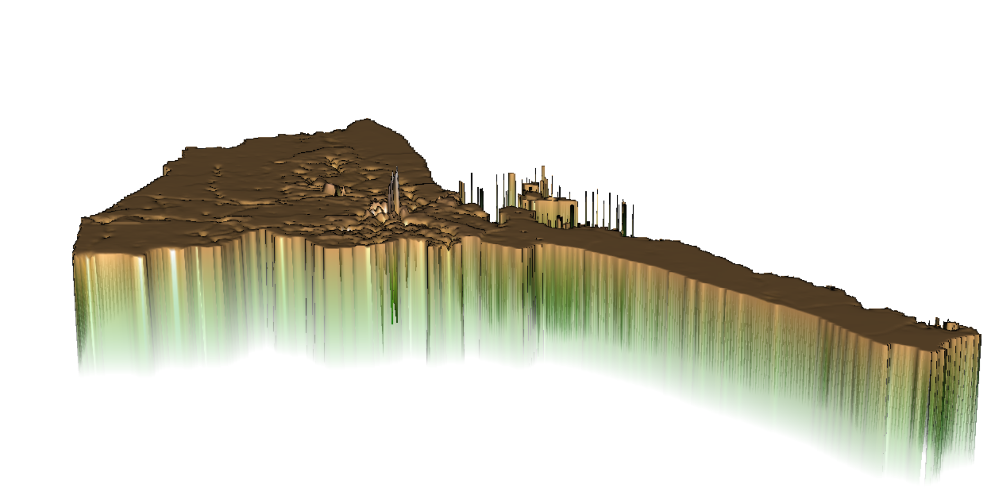
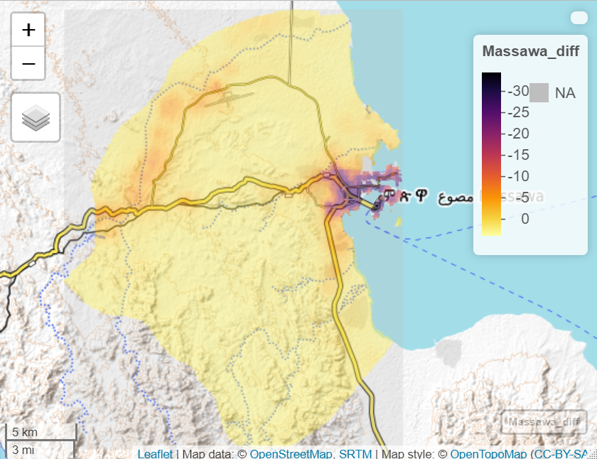
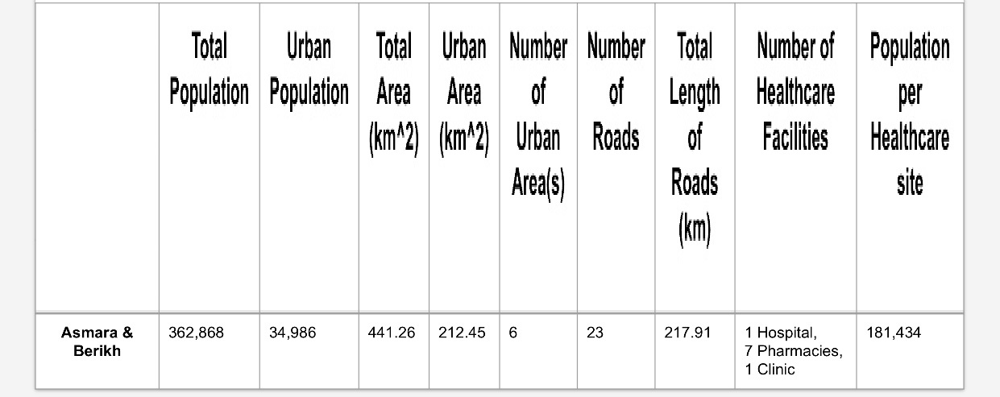
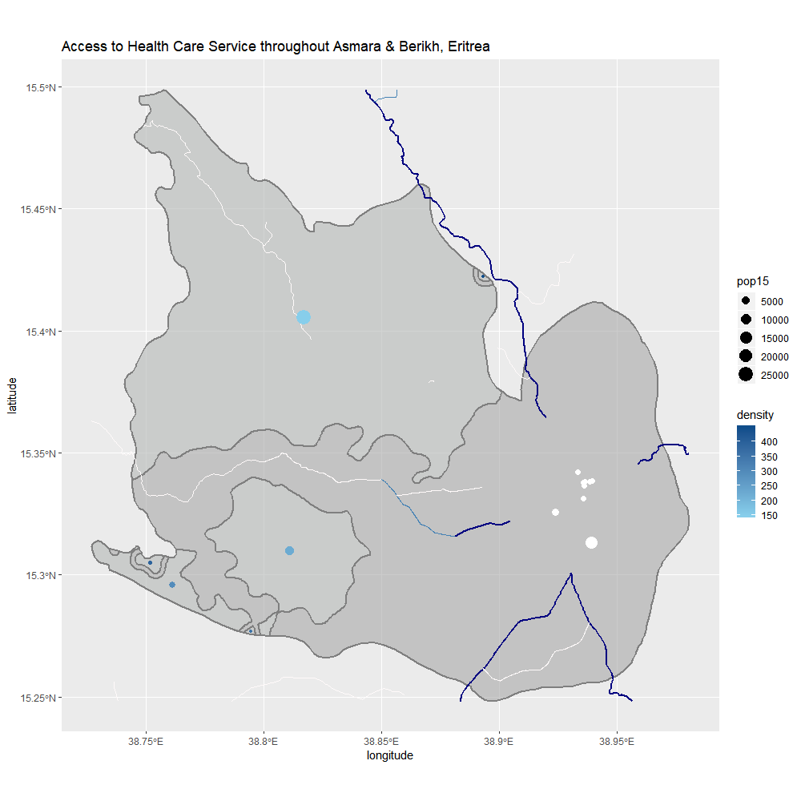

# Eritrea

 DATA 100 Final Project on Eritrea
 
## Administrative Units, Population and Description
Eritrea has 6 subdivisions: Anseba, Maekel, Gash Barka, Semenawi Keyih Bahri, Debub, Debubawi Keyih Bahri.  

### National Flag
  
Eritrea, or the State of Eritrea, is a country in the Horn of Africa near Sudan and Ethiopia.  
Eritrea has an area of 125,000 km^2.  
Asmara City ( The red point on map ) is capital city of Eritrea.  
Massawa is its national port on the Red Sea and was the capital during colonization period.  
Keren is now a commercial hub in Eritrea.  

### Population of Eritrea

Except Asmara, population density in Debub, including Massawa and Keren, is the highest among the 6 subdivisions. Debub shares 26.8% of Eritrea population and has a density over 1,000,000.

## Investigating Land Use and Land Cover
### Histograms with different variables
Night Time Lights Density of Eritrea, 2019  
 

Population Count in 2019  

2019 population Density of Eritrea  

### Regression Lines for different variable combinations
Correlation between water and topography& urban areas & night time lights & slope of Eritrea.
  
Statistics for Correlation between 2019 population and water& urban areas & bare areas in Eritrea
  
Correlation between 2019 population and water& herbaceous cover & mosaic natural vegetation & grasslands& lichens and mosses & sparse vegetation & tree cover, flooded, fresh or brakish water & urban areas & bare areas & slope & night time lights & topography in Eritrea.
  
Statistics for correlation between 2019 population and water& herbaceous cover & mosaic natural vegetation & grasslands& lichens and mosses & sparse vegetation & tree cover, flooded, fresh or brakish water & urban areas & bare areas & slope & night time lights & topography in Eritrea.

### 3 major models & comparison
#### Sum Model (population as response variable and predictors are the sum of covariates)  
   
Difference: Predictors-Sums
  
Population: Predictors-Sums
  

#### Mean Model (population as response variable and predictors are the mean of covariates)  
  
Difference: Predictors-Means
  
Population: Predictors-Means
  

#### Logarithm Model (Reponse variable is log of population and the predictors are mean of covariates)
.png).png).png)  
Difference: Response-Log of Population
  
Population: Response-Log of Population
  

#### Comparison
The r^2 for sum model ( population as response variable and predictors are the sum of covariates) is 0.5219, the r^2 for mean model is 0.3439 and the r^2 for logpop15 model is 0.3693. Among the three different r^2, 0.5219 is the biggest number, which indicates the sum model is the best prediction. However, these values all fall into the weak correlation range, which decrease the influence of r square in model judgement. Also, the p-value for the sum model, 3.056e-05, is the smallest among the three. For mean model it is 0.003684 and for logpop is 0.002093, which shows the extremely low possibility of coincidence.  
The absolute difference for sum model is 2621317, for means one is 4038076 and for the logpop15 is 2599955. Among the three values the 2599955 is the smallest, and thus presents a best visualized plot and smallest variation. In conclusion, the logpop15 model and the sum model yield the better results.  
Among this two, the small p-value and the smallest absolute difference value shows that the logpop15 model ( Reponse variable is log of population and the predictors are mean of covariates) produces the best result. The outstanding yellow and red spot on the two 2d logpop plots is Eritrea’s capital city-- Asmara. The peak on the following 3d plot also matches this location.  

### Mapview the Difference
#### Eritrea Overview

#### Asmara

#### Massawa

## Accessibility to Health Care through Transportation Networks
### Massawa
Population per grid cell throughout Massawa, Eritrea

Roadways throughout Massawa, Eritrea

When cropped, there are no health care sites in Massawa, neither airports. There are three big roads in Massawa.  
Eritrea is a young country that overall limited amounts of roads construction and facilities have been built on it at the moment the data was collected.  
Then I switched to its capital, at which almost all health care sites are.  

### Asmara
Access to Health Care Services throughout Asmara, Eritrea

### Comparison
#### Population
Massawa: 53,090
Asmara City: 896,000 in wiki (243,242 shown by Rstudio data)

#### Number of human settlements, urban areas
1.Massawa: 4  
The middle-right two dots are closed to the Red Sea, which indicates these urban areas with a density around 150 and pop15 around 175 may be flourished because of the ports in Massawa.  
The top dot are next to Keren and other more developed cities in Eritrea, thus this dot is of highest density and population in Massawa.
The upper-left light blue dot is near to the capital Asmara and it has a density of 100.  
2.Asmara: 2  
The range of density is different in Asmara , From 75 to 2000, to that in Massawa, from 75 to 250.  
The dot between those health care sites ( white dots ) may locate in CBD. It shows a pop15 of 60000 and a density of 1100.  

#### Roads and transportation networks and health care service description
1.Massawa:  
When cropped, there are no health care sites in Massawa, neither airports. There are three big roads in Massawa. Primary road is red, secondary blue, and tertiary yellow. Primary road is heading to the capital city (and almost all health care cites), the secondary roads is connecting to Foro and other coastal cities along the coast line next to Red Sea, and the tertiary road is heading to Keren ( population 12,000), one of the commercial hubs in Eritrea. The access to health services is weak.  
2.Asmara:  
The primary roads is in deep blue, secondary in blue and tertiary in white. The transportation network in Asmara is much more dense than that in Massawa.  
All health care service sites are clustered in the middle of Asmara on the map. People gather In between these facilities.  

## Future View of Eritrea Infrastructures and Services
### Asmara & Berikh
  
Total Population:  362868  
Total Area: 441264394 m^2  
6 Urban Area: 212448000 m^2  
Total Length of Roads: 217913.9m  
Primary Roads: 9  
Secondary Roads:3  
Tertiary Roads:11  
1 Hospital, 1 Clinic, 7 Pharmacies  
Population per healthcare sites: 40319  

#### 3D Mapview
.png)
.png)
.png)
.png)

### Topography impact on urban areas,transportation and health care sites.
Asmara and Berikh features plateau and mountains.  
Urban areas all locate in places with a few variation in altitude.  
All of the 6 urban areas are away from mountains and cliffs.  
Roads were more easily to built along the way wining up the mountain or goes along valleys.  
Similarly, all the health care sites are in Asmara City, capital of Eritrea, which is a plain. Roads clustered around those 9 health care sites and connect Asmara and Berikh.  
Eritrea locates on the northern tip of Ethiopia hinterland plateau with an altitude of 7876 feet (2325m).  
It mainly is plateau and has cliffs and valleys along with roads passing through.  
Asmara and Berikh are not closed to the Red Sea. High altitudes prevent roads constructions and transportation.  
Large density urban areas near Keren rather than Asmara, and there are no people clustering among health care sites.  

### Health Care Issue  
Over 2/3 of the people in Eritrea live below the poverty line.  
HIV is the dominant disease in Eritrea and the control of HIV is a national policy in Eritrea. (wiki)  
Malaria is a major health concern affecting 75% population. (World Bank)  

During 1998-2000, there was a 2 year war between Eritrea and Ethiopia. The final peace was not agreed until 2018.  
The political struggles result in losses of health workers in Eritrea in 2005. The number of physicians, nurses and midwives has doubled during the past 7 years.  
In 2003, Eritrea opened the first medical college.  
In 2012, graduates tripled the number of pediatricians and doubled the number of surgeons.  

# Thank you for reading!
